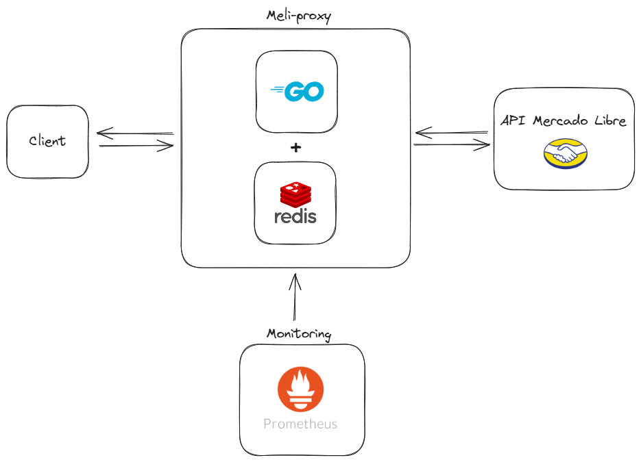
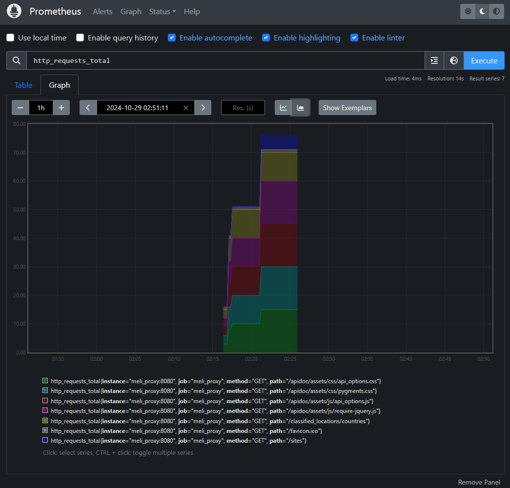

# Meli Proxy

Proxy intermediario entre un cliente y la API de Mercado Libre. Su función es la de validar la cantidad de peticiones por IP y por endpoint, permitiendo limitar la cantidad de peticiones en un intervalo de tiempo de manera configurable con variables de entorno.

El proxy está desarrollado en Go para que sea lo mas eficiente posible. Su funcionamiento es simple, se encarga de registrar cada petición en Redis, agrupándolas por IP y endpoint, y se encarga de validar en cada petición que la IP desde donde se está ejecutando la petición no haya superado la cantidad de peticiones máximas permitidas en el tiempo definido.

Además se complementa con un servicio de Prometheus para poder analizar las métricas del proxy de manera visual. Se definió una métrica custom como cantidad de peticiones por endpoint.

## Diagrama:

## Levantar entorno local:

El entorno local puede ser inicializado de manera muy sencilla usando Docker y ejecutando el comando: 
`docker compose up`

Luego, se expondrá el servicio del proxy en el localhost en el puerto definido en la variable de entorno.

## Visualizar estadisticas del proxy:

Una vez levantado localmente el proyecto se puede acceder a las métricas desde el servicio local de Prometheus para visualizar un resumen de la cantidad de peticiones hechas a cada endpoint.

Acceder al sevicio de Prometheus local:
[Prometheus](http://localhost:9090/graph?g0.expr=http_requests_total&g0.tab=0&g0.display_mode=stacked&g0.show_exemplars=0&g0.range_input=1h)

